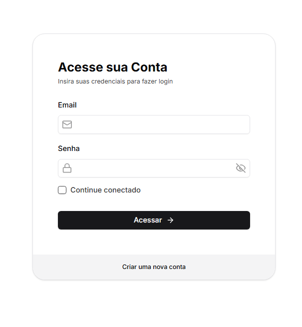
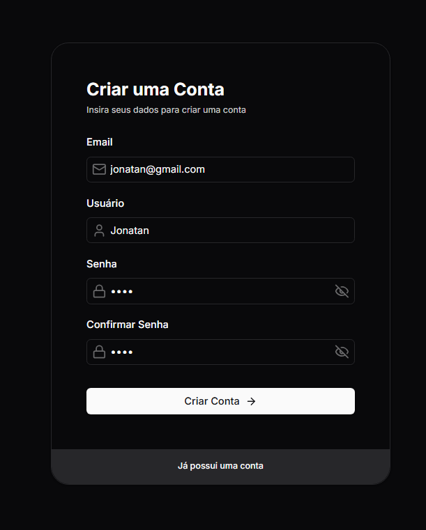
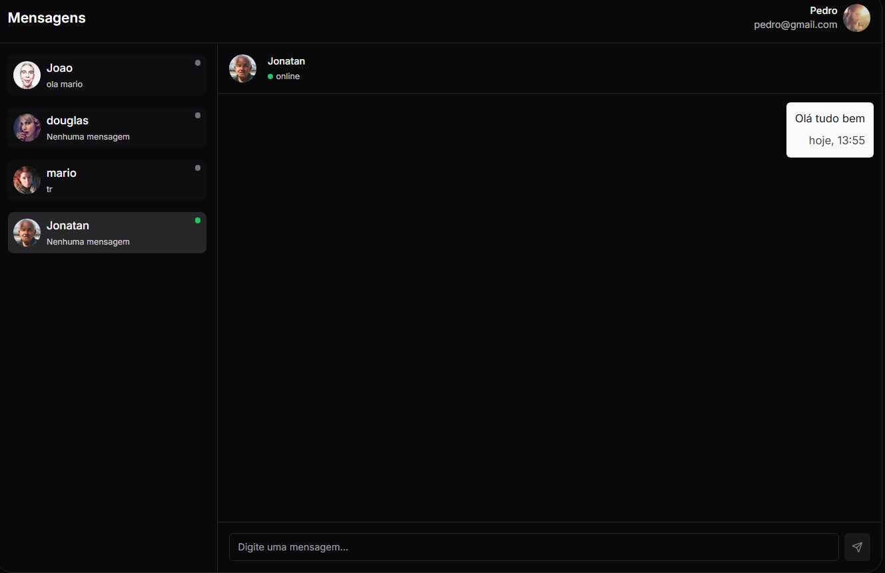
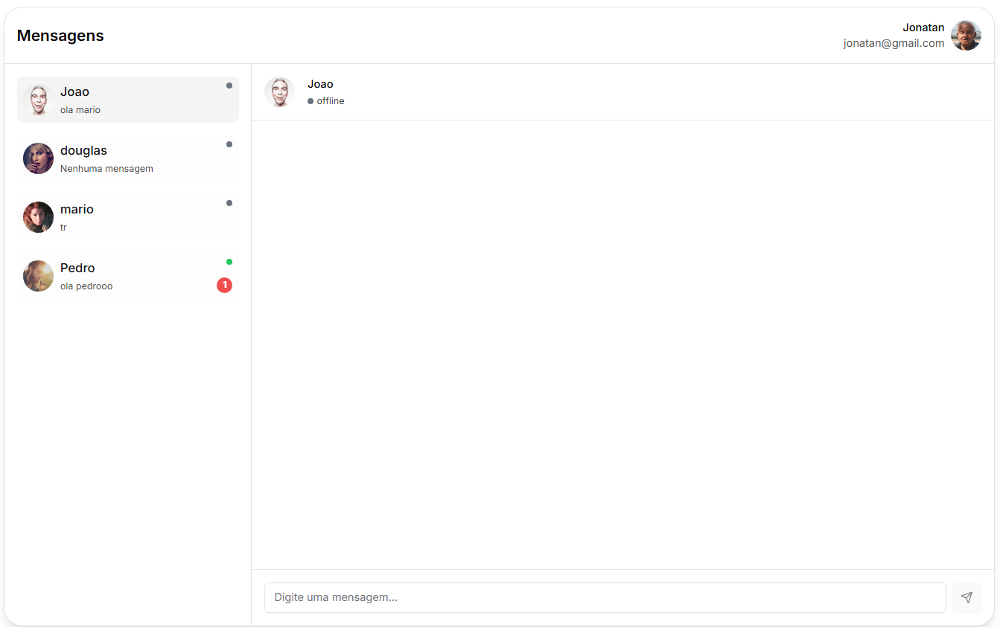

# Teste Opa! Suite Nível 2

## Visão Geral

Este projeto é uma aplicação web com funcionalidades de **cadastro**, **login** e **troca de mensagens em tempo real** entre usuários cadastrados. Ele foi desenvolvido com:

- **Backend**: Node.js (Express) com MongoDB para armazenamento de dados.
- **Frontend**: React/Next.js.
- **Comunicação em tempo real**: Socket.IO.

---

## Estrutura do Projeto

O projeto está organizado em duas pastas principais:

- **backend/**: Contém a API construída em Node.js.
- **frontend/**: Contém a interface web desenvolvida em React/Next.js.

---

## Funcionalidades Implementadas

### Backend

1. **Cadastro de Usuários**

   - Rota: `/api/register`
   - Método: `POST`
   - Campos: `nome`, `username`, `senha`.
   - Armazenamento: MongoDB.
   - Feedback: Retorna sucesso ou falha.

2. **Autenticação de Usuário**

   - Rota: `/api/login`
   - Método: `POST`
   - Biblioteca: `passport.js` para autenticação.
   - Controle de rotas privadas/públicas.

3. **Chat em Tempo Real**

   - Biblioteca: `socket.io` para mensagens em tempo real.
   - Persistência: Mensagens armazenadas no MongoDB.

4. **Lista de Usuários Online/Offline**
   - Atualização em tempo real usando `socket.io`.
   - Exibição de status (online/offline).

---

### Frontend

1. **Tela de Login**

   - Página para autenticação usando username e senha.
   - Feedback visual em caso de erro.

2. **Tela de Chat**

   - Interface para troca de mensagens em tempo real.
   - Notificações visuais para novas mensagens recebidas.

3. **Lista de Usuários Online/Offline**
   - Exibição do status de cada usuário conectado.

---

## Pré-requisitos

- **Node.js** (v20 ou superior)
- **MongoDB** (Atlas)

---

## Principais Tecnologias Utilizadas

### Frontend

- **Next.js**: Framework React para renderização híbrida e desenvolvimento de aplicações web rápidas e escaláveis.
- **TypeScript**: Superset do JavaScript que adiciona tipagem estática ao código.
- **Axios**: Biblioteca para realizar requisições HTTP.
- **Zustand**: Gerenciador de estado leve e flexível.
- **Socket.IO**: Comunicação em tempo real entre cliente e servidor.
- **Shadcn**: Biblioteca de componentes estilizados com suporte ao Tailwind CSS.
- **React Hook Form**: Gerenciamento de formulários com foco em performance.
- **Zod**: Biblioteca de validação de schemas.
- **Lucide Icons**: Conjunto de ícones personalizáveis.

### Backend

- **Node.js**: Ambiente de execução JavaScript para o lado do servidor.
- **Express.js**: Framework minimalista para construção de APIs em Node.js.
- **TypeScript**: Superset do JavaScript para maior segurança e organização do código.
- **MongoDB**: Banco de dados NoSQL utilizado para armazenar dados da aplicação.
- **Mongoose**: ODM para interação com o MongoDB.
- **Passport.js**: Biblioteca para autenticação de usuários.
- **Socket.IO**: Comunicação em tempo real entre servidor e cliente.

## Instruções de Instalação e Execução

### Backend

1. Navegar ate a pasta `back`
2. instalar dependências: `npm install`
3. Iniciar o servidor: `npm run dev`

### Frontend

1. Navegar ate a pasta `front`
2. instalar dependências: `npm install --force`
3. Iniciar o servidor: `npm run dev`
4. Estará disponível na URL: `http://localhost:3000` e `http://localhost:3001`, para que seja possível testar o chat.
5. Abrir cada página em um navegador diferente.

## Fotos

  
  
  
  

